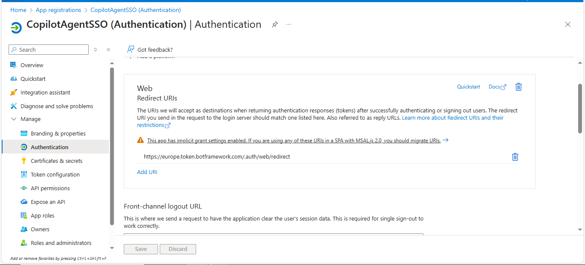
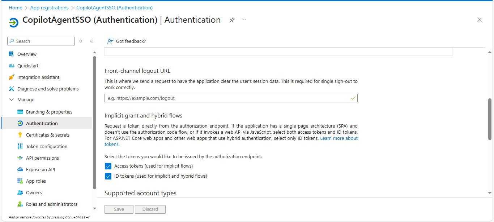
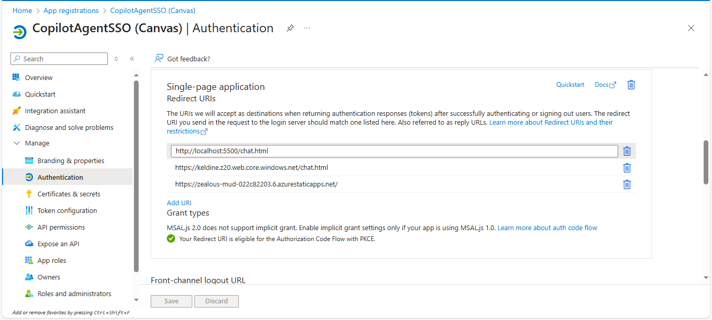
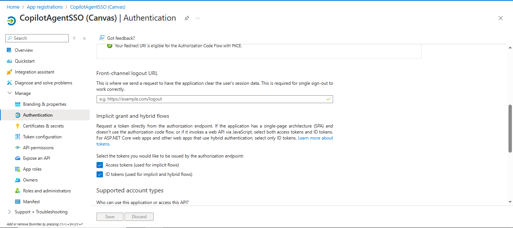
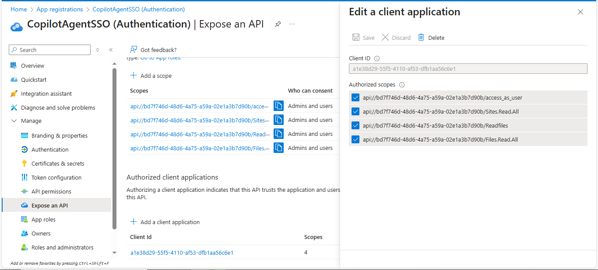
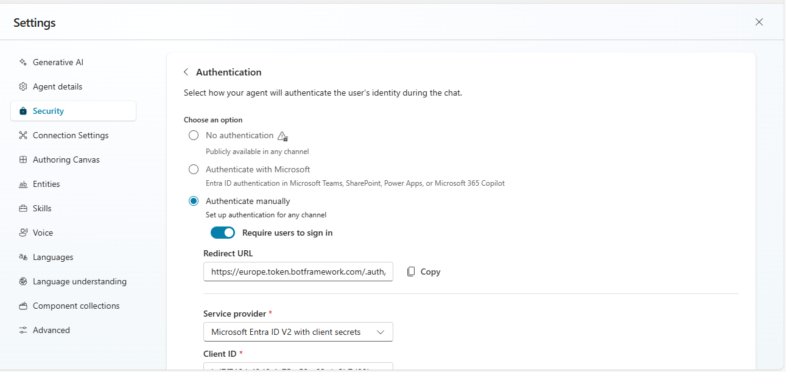
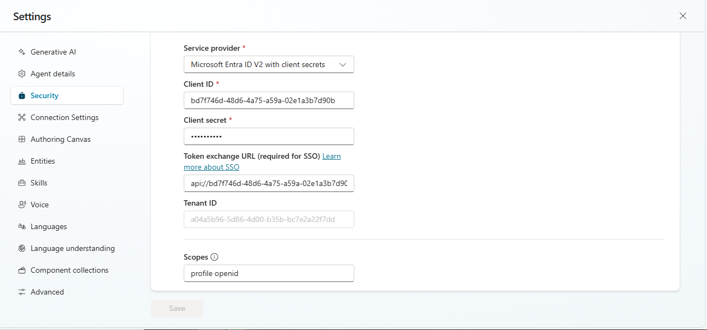

# CopilotStudioSSOAgent
This is a custom Copilot Studio agent with Single Sign-On (SSO) built using HTML, CSS, and JavaScript.
It's integrated with different data sources including a SharePoint library.

Live demo:   ```
 https://example-demo-link.com
  ```

Test credentials:

| **Username** | ``` testuser@example.com ``` |
| **Password** | ``` Test1234!``` |


# 🧩 Single Sign-On (SSO) Setup for Copilot Studio — Manual Authentication

This guide explains how to configure **manual authentication (SSO)** for your Microsoft Copilot Studio agent.  
Based on the instructions by official [Microsoft documentation](https://learn.microsoft.com/en-us/microsoft-copilot-studio/configure-sso).

---

## 🧰 Prerequisites

Before you begin:
- A valid **Microsoft Entra ID (Azure AD)** tenant and admin access.  
- A **custom web canvas page** where your Copilot will be embedded.  
- Your Copilot agent should include a **Sign-in** topic or authentication trigger.  

---

## ⚙️ Step 1: Create Two App Registrations in Entra ID

### 1️⃣ Authentication App Registration
1. Go to **Azure Portal → App registrations → New registration**.  
2. Name it (e.g. `MyCopilot-AuthApp`).  
3. Under **Supported account types**, choose as needed (e.g. “Accounts in any organizational directory and personal Microsoft accounts”).  
4. After creation, navigate to **Authentication → Add a platform → Web**.  
5. Add redirect URI:  https://token.botframework.com/.auth/web/redirect
6. Under **Implicit grant and hybrid flows**, enable:
- ✅ Access tokens  
- ✅ ID tokens  
7. In **Certificates & secrets → New client secret**, generate and securely copy the secret value.  





### 2️⃣ Canvas App Registration
1. Create another app registration, e.g. `MyCopilot-CanvasApp`.  
2. Under **Authentication → Add a platform**, select:
- **Single Page Application (SPA)** if hosted as a web app  
- **Web** if using a backend or server-rendered page.  
3. Add your custom canvas page URL, for example: https://yourdomain.com/index.html
4. Under **Implicit grant and hybrid flows**, enable:
- ✅ Access tokens  
- ✅ ID tokens  
5. Copy the **Application (client) ID** — you’ll need it later.





---

## 🔑 Step 2: Define a Custom Scope & Trust Relationship

1. Open your **Authentication App Registration**.  
2. Go to **Expose an API → Add a scope**.  
- Example:
  ```
  api://<Auth-App-Client-ID>/MyCopilotScope
  ```
3. Save the scope.  
4. Under **Expose an API → Add a client application**, paste the **Canvas App’s Client ID** to create a trusted relationship.  



---

## 🪄 Step 3: Configure Manual Authentication in Copilot Studio

1. In **Copilot Studio**, open your agent.  
2. Go to **Settings → Security → Authentication**.  
3. Choose **Authenticate manually**.  
4. Fill in the following fields:

| Field | Description |
|--------|-------------|
| **Service Provider** | Microsoft Entra ID v2 with client secrets / Azure AD v2 |
| **Client ID** | Authentication App’s Client ID |
| **Client Secret** | Secret created earlier |
| **Token Exchange URL** |  custom scope URI (e.g. `api://<Auth-App-ID>/MyCopilotScope`)|
| **Scopes** | Custom scope (e.g openid, offline) |


5. Click **Save**, then **Publish** your Copilot to apply the changes.





---

## ✅ Step 4: Verification

After setup:

- Launch your Copilot via your custom canvas web page (index.html).
- The authentication logic is already implemented in the page — you only need to replace the placeholder values (e.g. clientId, tenantId, and redirectUri) where comments indicate in the code.
- Once updated, publish and test.

---

## ⚠️ Notes & Tips

- Use **two separate app registrations** — one for authentication and one for the canvas.  
- Redirect URIs must **exactly** match (including trailing slashes).    
- Re-publish your agent anytime you change authentication settings.  

---

📘 **References**
- [Neil Haddley — Configure Copilot Single Sign-On for Web](https://haddley.github.io/posts/configurecopilotsinglesignonforweb/)
- [Microsoft Docs — Configure SSO in Copilot Studio](https://learn.microsoft.com/en-us/microsoft-copilot-studio/configure-sso)

---


